<div align="center">

  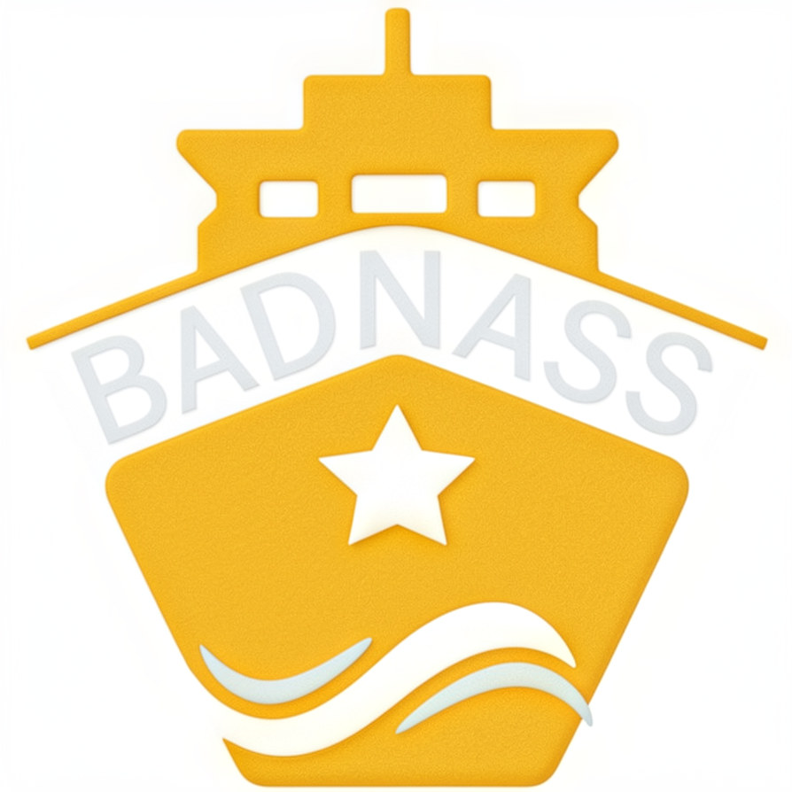

  # BADNASS Transit & Logistics — Gate 4 Ingestion Platform

  **High-throughput customs brokerage, TIR 44T compliance guardrails, AES-256 PII protection, and WORM-sealed audit trails for Tanger Med Port.**

  [-success?style=for-the-badge&logo=pytest)](reports/test_execution_summary.txt)
  [](htmlcov/index.html)
  [](reports/figures/ag_diagram.png)
  [](reports/figures/erd_diagram.png)
  [](reports/figures/dfd_diagram.png)
  [](src/api/errors.py)

</div>

---

## 1. Executive Summary & Core Value Proposition

**BADNASS Transit & Logistics** (*Transitaire Agréé en Douane N° AD/2026/TM-88*) operates at the strategic crossroads of Mediterranean and Atlantic freight routes in **Tanger Med Port**. 

The **Gate 4 Ingestion Platform** is a mission-critical logistics dispatch and customs declaration engine engineered to ingest, authenticate, validate, and track Ro-Ro trucks, TIR convoys, and multimodal containers. It enforces strict regulatory compliance (Convention TIR 44T, ONSSA cold-chain verification, CNDP data privacy) while providing zero-trust cryptographic defense against payload tampering and replay attacks.

### Operational Performance Targets

| Metric | Target SLA | Implementation Guarantee |
| :--- | :---: | :--- |
| **Gate 4 Turnaround Time** | **< 12 minutes** | Direct Portnet / BADR EDI teletransmission & instant BAD issuance |
| **TIR Overweight Hard-Stop** | **44,000 kg** | Real-time axle weighbridge IoT telemetry & domain validation rejection |
| **Driver Data Privacy (CNDP)** | **Zero PII Exposure** | AES-256-GCM authenticated encryption at rest (Loi 09-08 compliance) |
| **Anti-Replay Security Window** | **< 300 seconds** | Temporal drift validation + Redis atomic JTI / Idempotency verification |
| **Audit Ledger Integrity** | **Tamper-Evident** | WORM append-only SHA-256 cryptographic hash chaining |

---

## 2. System Architecture & Technical Specifications

The platform is architected using **Hexagonal (Ports & Adapters)** design principles, decoupling core transit domain invariants from infrastructure drivers (FastAPI web framework, Async SQLAlchemy ORM, Redis temporal caches, and Grafana Loki sinks).

```
                            ┌─────────────────────────────────────────┐
                            │    Client B2B / Operator Single Page    │
                            │      Vanilla JS + Tailwind Daylight     │
                            └────────────────────┬────────────────────┘
                                                 │ HMAC-SHA256 / JWT
                                                 ▼
┌─────────────────────────────────────────────────────────────────────────────────────────────┐
│                               BADNASS INGESTION API GATEWAY                                 │
│                                                                                             │
│   [ POST /auth/login ]          [ POST /api/v1/dispatch ]        [ POST /api/v1/telemetry ] │
│   Argon2id + JWT Engine         HMAC + Anti-Replay + Idemp       IoT Weighbridge Sensor Hub │
└───────────────────────┬────────────────────────┬────────────────────────────┬───────────────┘
                        │                        │                            │
                        ▼                        ▼                            ▼
┌─────────────────────────────────────────────────────────────────────────────────────────────┐
│                              HEXAGONAL DOMAIN & APPLICATION CORE                            │
│                                                                                             │
│    • Domain Invariants (Weight ≤ 44T, Hubs Disjoint, TrackingRef Regex)                     │
│    • Security Identity (Role-Based Access Control: Operator, B2B, Technician, SecAdmin)    │
│    • Dispatch Order Aggregate & Telemetry Measurement Lifecycle                             │
└───────────────────────┬────────────────────────┬────────────────────────────┬───────────────┘
                        │                        │                            │
        ┌───────────────┴──────────────┐         │          ┌─────────────────┴───────────────┐
        ▼                              ▼         ▼          ▼                                 ▼
┌─────────────────┐          ┌─────────────────────┐  ┌──────────────────┐          ┌─────────────────┐
│ Async SQLAlchemy│          │   AES-256-GCM PII   │  │  WORM SHA-256    │          │  Redis Cache /  │
│ SQLite / PG DB  │          │   Field Encryptor   │  │  Hash Chain Sink │          │  Anti-Replay    │
└─────────────────┘          └─────────────────────┘  └──────────────────┘          └─────────────────┘
```

### Architecture Specifications & Visual Models

#### Global System Architecture
Comprehensive topology illustrating client ingestion, API gateway, domain core, and persistence adapters:
<p align="center">
  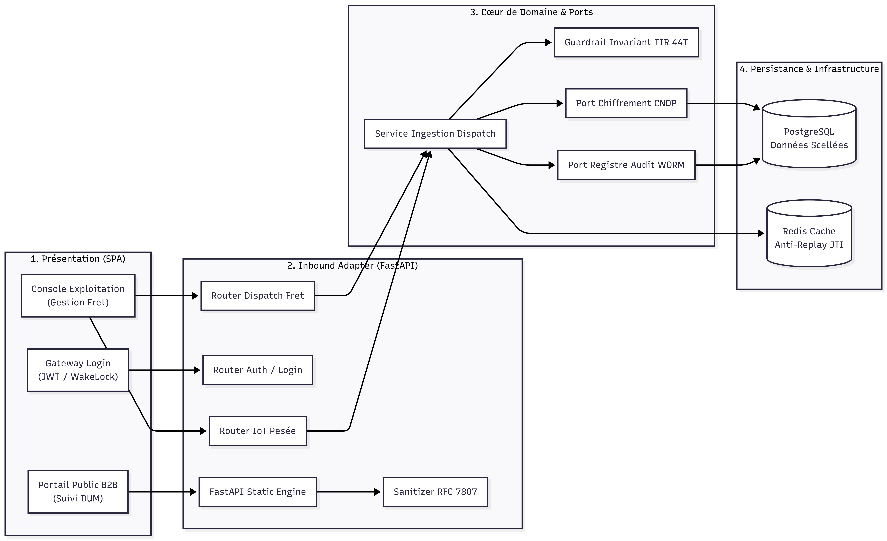
</p>

#### Ingestion Sequence & Cryptographic Verification
Step-by-step transaction lifecycle displaying client HMAC signing, anti-replay validation, domain invariant checking, and WORM ledger logging:
<p align="center">
  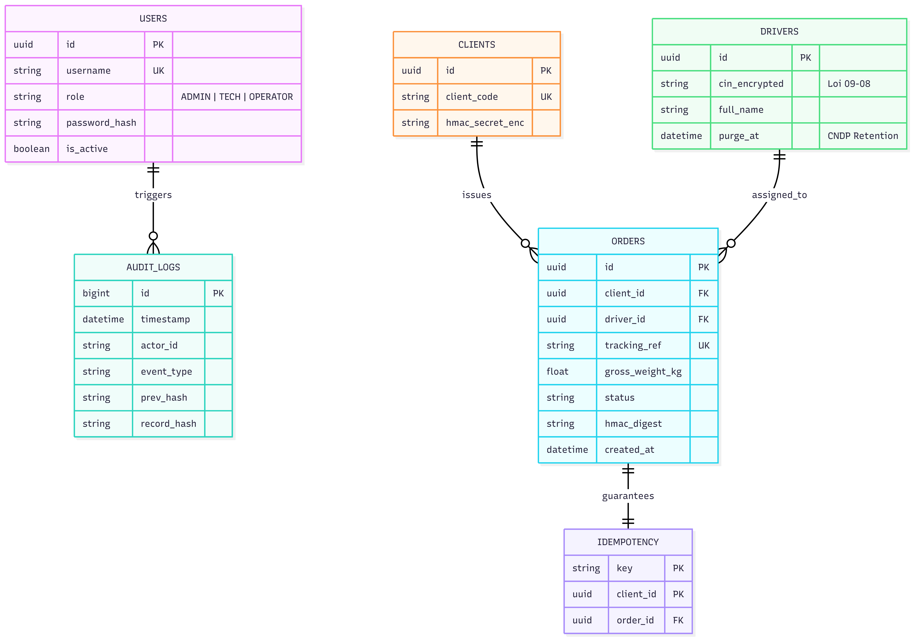
</p>

#### Domain Class Diagram (Hexagonal Architecture)
Clean separation of Domain Entities, Use Cases, Application Ports, and Infrastructure Adapters:
<p align="center">
  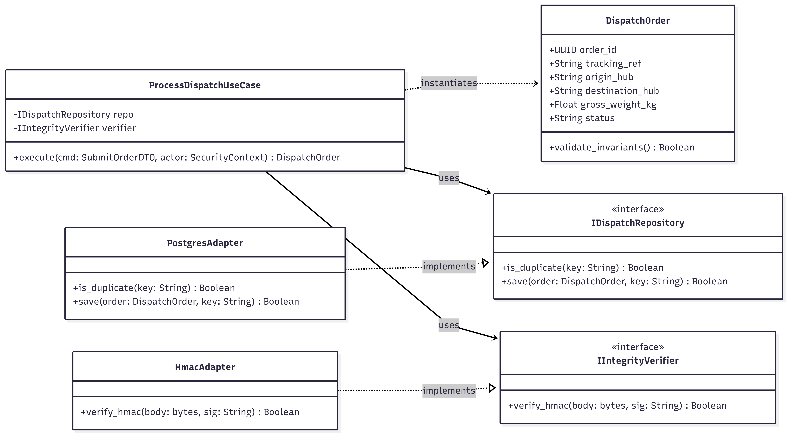
</p>

#### Data Flow & Loki Audit Pipeline
Secure data flow routing telemetry and dispatch orders through the tamper-evident WORM logging engine:
<p align="center">
  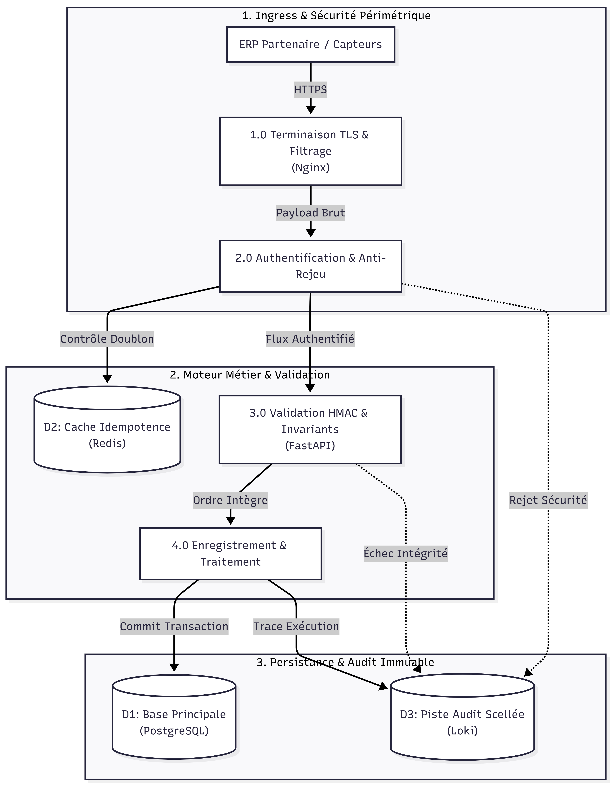
</p>

#### Relational Data Model & CNDP Encryption (ERD)
Entity-Relationship model detailing tables, constraints, foreign keys, and AES-256 encrypted driver fields:
<p align="center">
  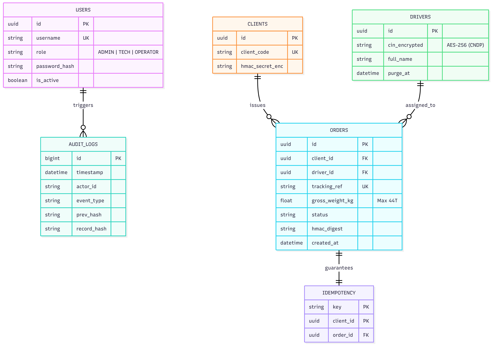
</p>

---

## 3. Interactive User Experience & Operational Evidence

The platform features a **Daylight Enterprise UI** (`#F8FAFC` background, pure white cards, Tanger Med gold `#F5B324` accents, and navy slate `#0F172A` typography) with zero npm build dependencies.

### B2B Public Portal & Live Clearance Tracking

| Corporate Landing Page (`#portal-home`) | Multi-Stage Public Tracking Stepper (`#portal-tracking`) |
| :---: | :---: |
| 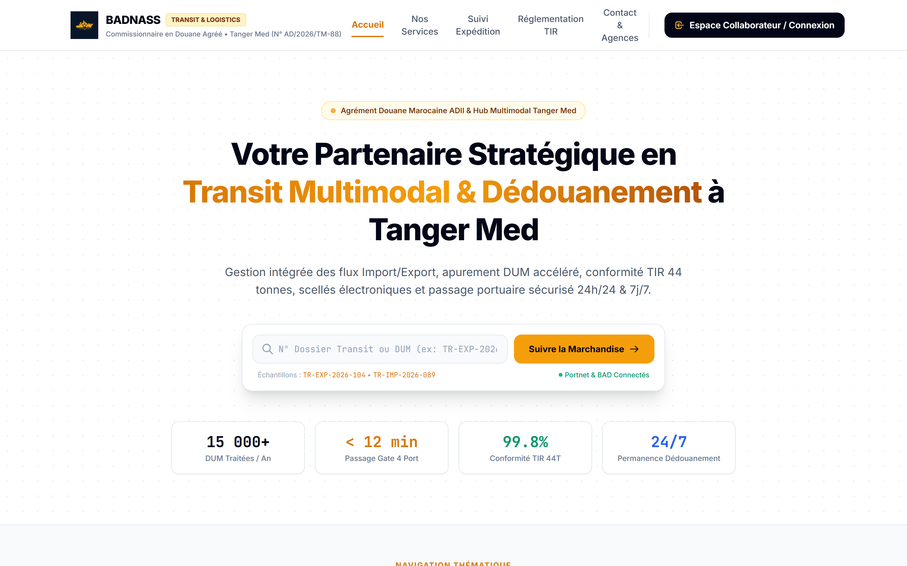 | 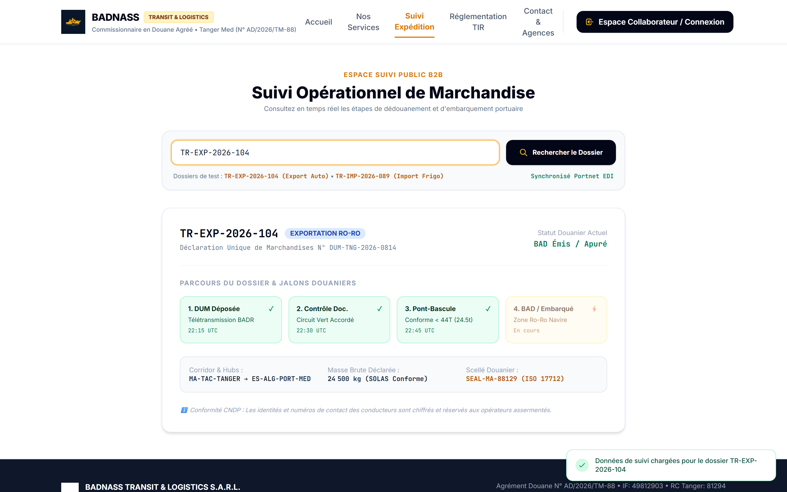 |
| *3-Zone collision-free header, corporate mission statement, and operational KPI counters.* | *Real-time 4-milestone clearance tracking (DUM → Inspection → Scale → BAD) with zero driver PII exposure.* |

### Authenticated Operations Console

The internal operations workstation provides live multi-criteria filtering, KPI cards, and an enriched dispatch registry table:
<p align="center">
  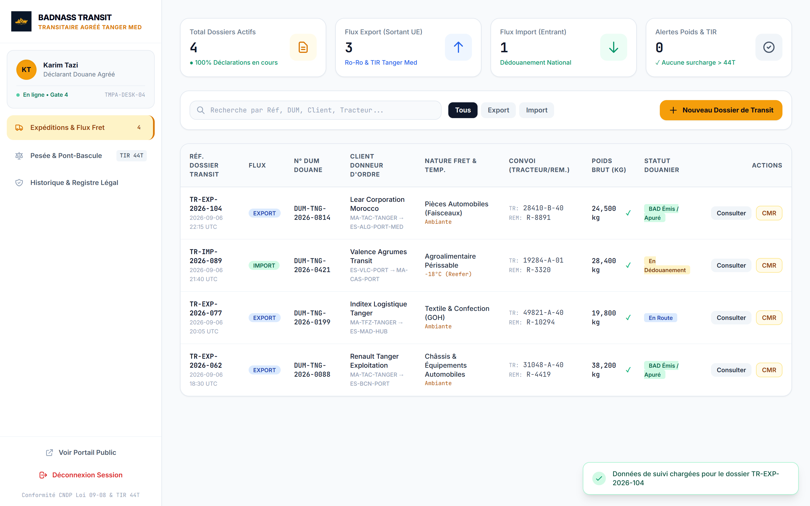
</p>

### Invariant Guardrails: Nominal Weight vs TIR 44T Overload Warning

| Nominal File Creation (< 44.00 t) | Overweight TIR Warning (> 44.00 t) |
| :---: | :---: |
| 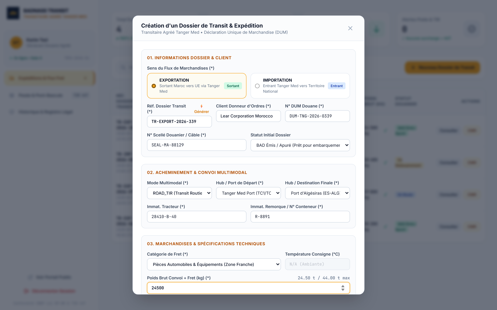 | 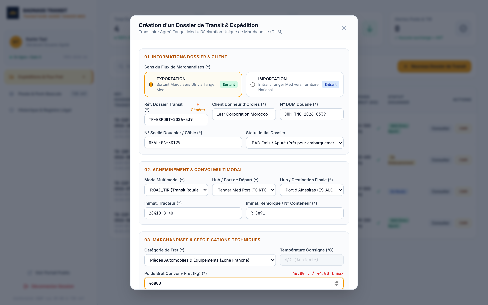 |
| *24,500 kg nominal freight entry displaying compliant green status (`24.50 t / 44.00 t max`).* | *46,800 kg overload input triggering the dynamic red warning banner preventing Gate 4 blockage.* |

### Gate 4 Weighbridge IoT Telemetry & WORM Audit Trail

| Gate 4 Weighbridge Overload Gauge | Tamper-Evident WORM Audit Ledger |
| :---: | :---: |
| 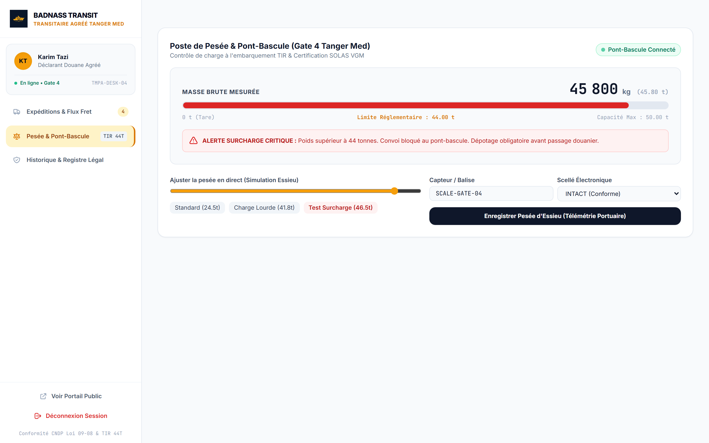 | 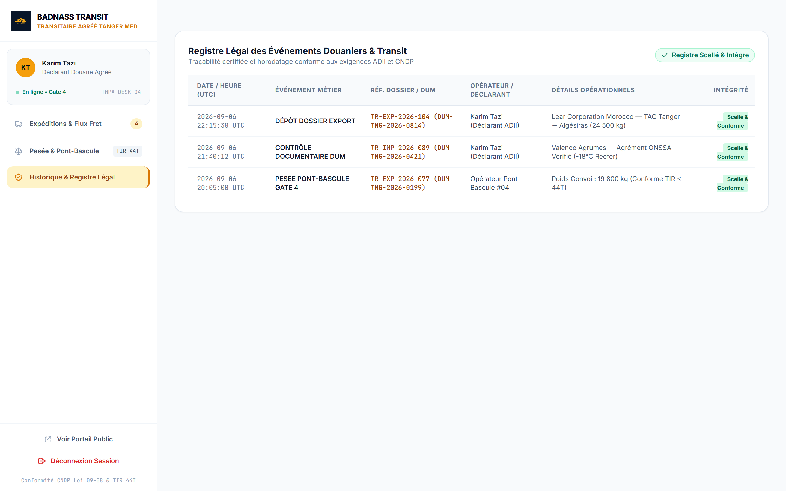 |
| *Live 0–50t weighbridge gauge at 45.8t showing critical surcharge blockage alert.* | *Chronological WORM audit trail displaying sequential SHA-256 hash chains and compliance badges.* |

---

## 4. Verification & Quality Assurance

The test suite thoroughly evaluates nominal workflows, domain invariant violations, authentication/RBAC authorization, cryptographic tampering, and temporal anti-replay attacks.

### Pytest Execution Summary

```text
============================= test session starts =============================
platform win32 -- Python 3.11.0, pytest-9.1.1, pluggy-1.6.0
collected 67 items

tests/test_api_integration.py ............                               [ 17%]
tests/test_coverage_booster.py ................                          [ 41%]
tests/test_domain.py ...........................                         [ 82%]
tests/test_use_cases.py ............                                     [100%]

=============================== tests coverage ================================
Name                                Stmts   Miss  Cover   Missing
-----------------------------------------------------------------
src\api\dependencies.py                59      6    90%   92, 96-97, 102-104
src\api\errors.py                      40      4    90%   122-131
src\api\routes.py                      97     18    81%   102-125, 201, 222-225, 267, 296-299
src\application\ports.py               22      6    73%   21, 25, 29, 57, 77, 88
src\application\use_cases.py           48      3    94%   99, 131-132
src\domain\models.py                   64      5    92%   69, 73, 122, 125, 129
src\infrastructure\audit.py            57      5    91%   117-131, 173
src\infrastructure\crypto.py           41      2    95%   50-51
src\infrastructure\persistence.py      77      8    90%   54-66, 186, 214-219
-----------------------------------------------------------------
TOTAL                                 505     57    89%
======================== 67 passed, 1 warning in 4.39s ========================
```

### Running Tests Locally

```bash
# Activate virtual environment
.venv\Scripts\activate   # On Windows
# source .venv/bin/activate # On Linux/macOS

# Run complete test suite with coverage
pytest -v --cov=src --cov-report=term-missing --cov-report=html
```

---

## 5. DevSecOps & Automated Security Pipeline

The CI/CD pipeline enforces security scanning, static analysis, container vulnerability assessment, and artifact signing before any deployment:

<p align="center">
  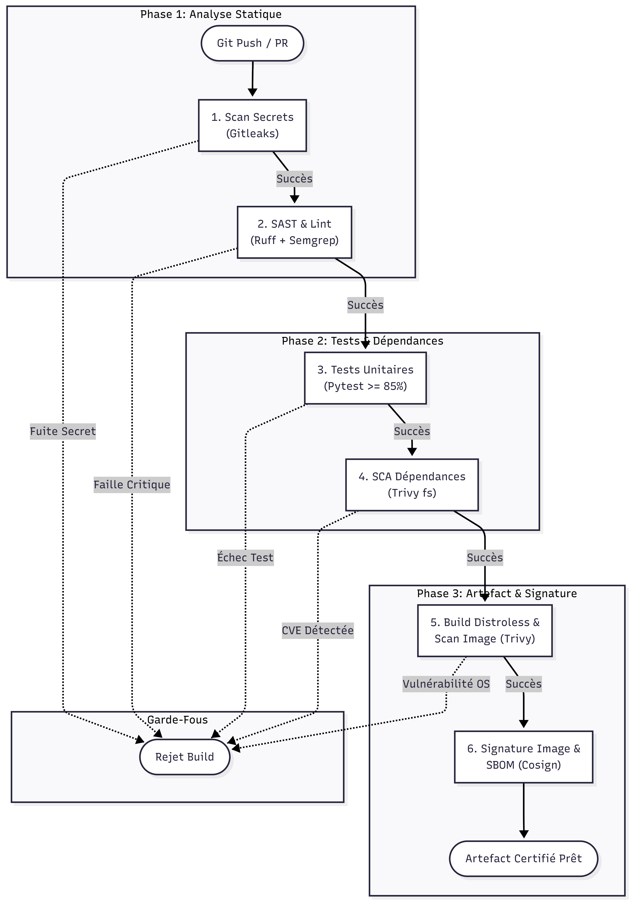
</p>

- **Secret Detection**: `Gitleaks` scans all commits for exposed credentials.
- **SAST & Linting**: `Ruff` and `Semgrep` scan for security anti-patterns and OWASP Top 10 vulnerabilities.
- **Container Scanning**: `Trivy` inspects base image CVEs.
- **Supply Chain Security**: `Cosign` cryptographically signs all container images pushed to the container registry.

---

## 6. Quickstart Guide (Local Development)

### Prerequisites
- Python 3.11+
- Git

### 1. Clone & Setup Environment
```bash
git clone https://github.com/1ntr0V3r/badnass-dispatch.git
cd badnass-dispatch

# Create virtual environment
python -m venv .venv
.venv\Scripts\activate

# Install dependencies
pip install -r requirements.txt
```

### 2. Start the Local Server
```bash
python run_local.py
```

### 3. Access Service Endpoints
- **Operations Console & Public Portal**: [http://127.0.0.1:8001/ui](http://127.0.0.1:8001/ui)
- **Interactive Swagger Documentation**: [http://127.0.0.1:8001/api/docs](http://127.0.0.1:8001/api/docs)
- **ReDoc Contract**: [http://127.0.0.1:8001/api/redoc](http://127.0.0.1:8001/api/redoc)
- **Health Check Endpoint**: [http://127.0.0.1:8001/health](http://127.0.0.1:8001/health)

---

<div align="center">
  <sub>BADNASS TRANSIT & LOGISTICS S.A.R.L. • Tanger Med Port Center, Bâtiment Transit 2, Bureau 104 • Tanger, Maroc</sub><br />
  <sub>Agrément Douane N° AD/2026/TM-88 • Conformité CNDP Loi 09-08 • Convention TIR 1975</sub>
</div>
